# FYP: Defect characterisation of GaN-based materials’ surface using Python
My final year project (FYP) was to create a program that can detect and count defects in atomic force microscopy (AFM) images of gallium nitride (GaN) based materials' surface. Defects can be characterised by their appearance, often appearing as small black dots or as larger bright spots in AFM images.  

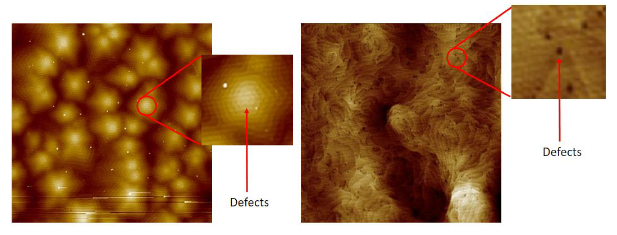 

This project attempts to train and use artificial neural networks, specifically, U-Net, to help with segmentation of the defects from the background. A good model generally requires a large number of training samples. However, since I was only given a small sample size, data augmentation was used to supplement the lack of data. Do note that data augmentation could only do so much to increase the variation, the final trained model might be overfitted to the training images.

## Implementation
### Image pre-processing
Corrupted regions of the given AFM images were reconstructed using inpainting to prevent the model from learning the wrong pattern.  
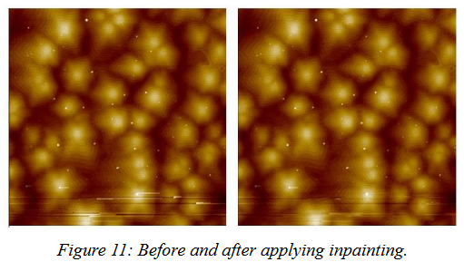  

### Data annotation
Using imageJ software to manually annotate the defects on training images.  
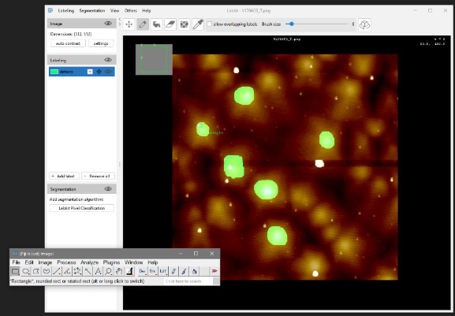  
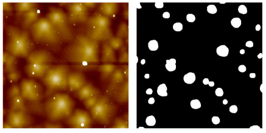

### Data augmentation
Albumentation library was used for data augmentation. Original training data were introduced to realistic transformation such as elastic deformation, grid distortion, rotations, and addition of noise.  
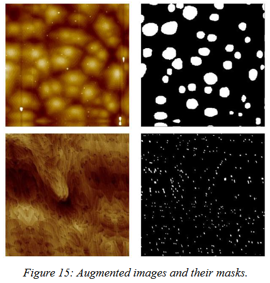

### Training and Inference
Two model was trained for 100 epochs each using a train-test split ratio of 95-5. Model 1 achieve a respectable test IoU score of 0.879 while model 2 only achieve a score of 0.536 which can largely be attributed to the lack of training data.  
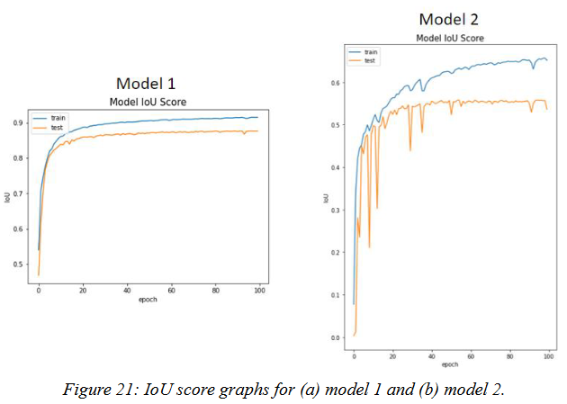  
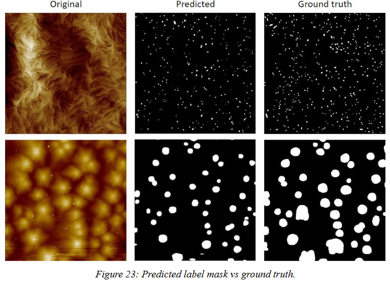

### Object detection
Now that the segmentation has been done, the number of segmented defects can be located and count using OpenCV's connected component analysis function.  

|Original|Output|
|---|---|
|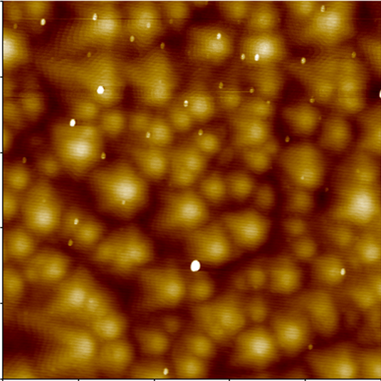|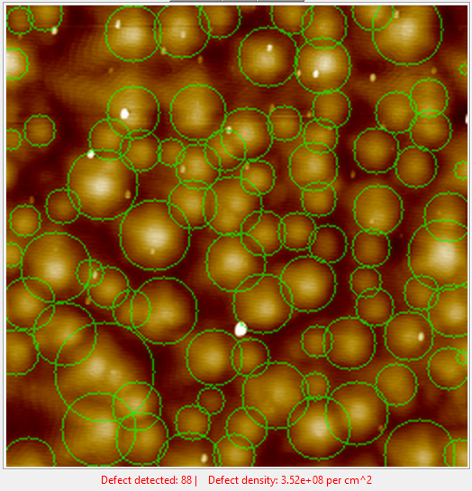  |
|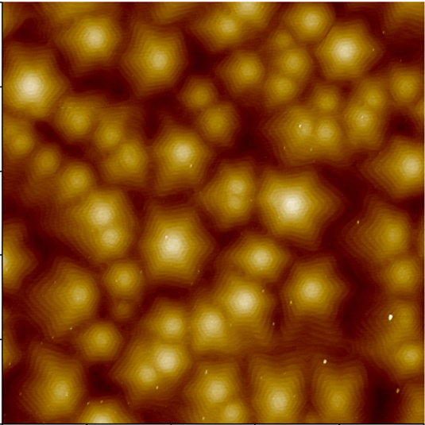|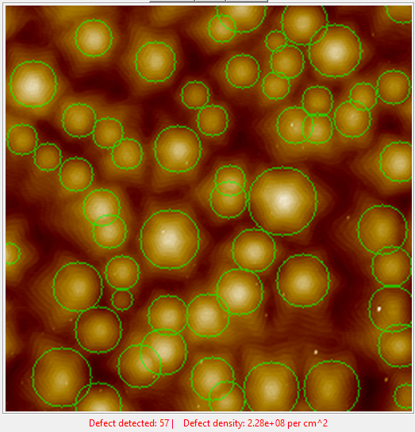  |
|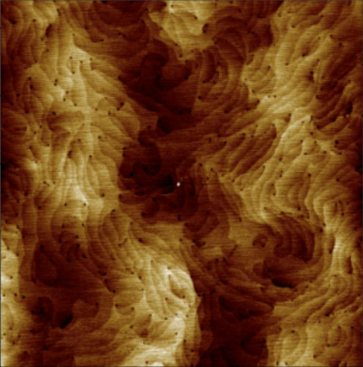|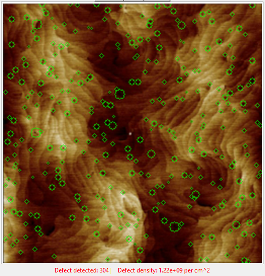  |

### GUI
A GUI was also created using Tkinter for ease of use.  
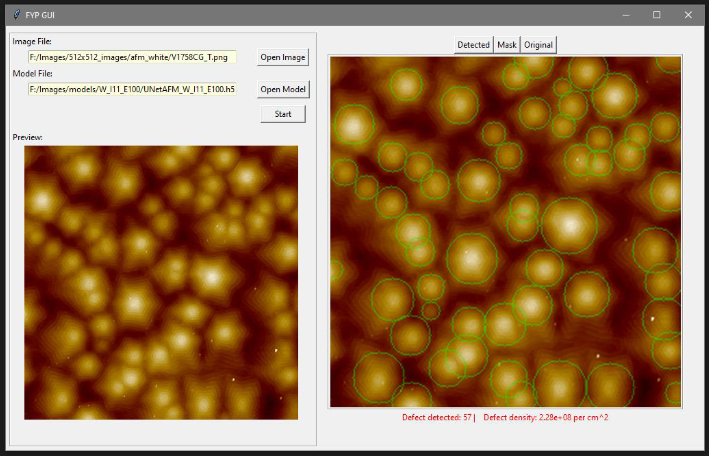

## Reflection
The trained models are not perfect, there are still many areas of improvement. During data labelling stage of this project, many defects were not accurately labelled partly due to a lack of clear understanding of what is or is not considered a defect. The large number and small size of defects also makes it very tedious and difficult to label correctly. This mislabelling might have negatively impacted the performance of the model. Perhaps this portion could have been done with more caution and understanding in the future. The lack of training samples also led to non-ideal IoU score for model 2. Just by having more images available, the performance of these trained models can be further improved. Lastly, other neural network architecture such as feature pyramid network and linknet could be explored. 