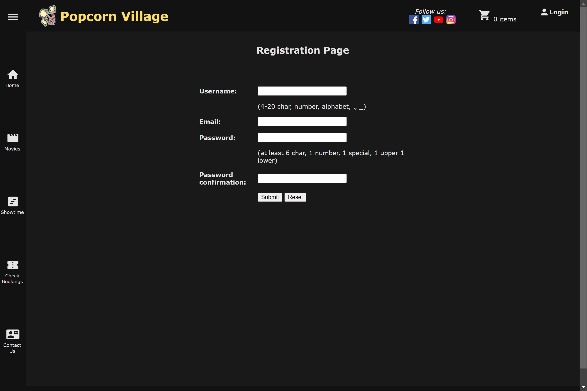

# IE4717_Proj_Popcorn_village
This team project is for the IE4717 Web Application Design module. The task was to create a web application using HTML, CSS, JavaScript, PHP and MySQL on the Apache web server. 

This web app is of a generic movie booking website containing all the basic features such as signups and logins, viewing of movie details and timeslots, booking of seats, shopping cart, and checking of bookings.

## Screenshots

| | |
|---|---|
|||
|||
|||
|||
|||
|||

## Running this project
* Download and install XAMPP and put this project into the htdocs folder found inside the XAMPP installed location.
* Run XAMPP and start the Apache web server and MySQL server.
* Setup the MySQL database. (Instructions below)
* Go to this url `localhost:8000/<project folder name>/`. (Port No. might be different)

## To setup local mail (requires thunderbird, xampp mercury):
1. click on admin for mercury's row
2. add local user
3. login on thunderbird

setup local email for testing:
|who |username |personal name |Password |
|-----|---------|--------------|---------|
| any | popcorn | popcorn | popcorn |
| any | village | village | village |
| us | popcorn_village | popcorn_village | village|

setup local email for demo:
|who |username |personal name |Password |
|-----|---------|--------------|---------|
| you | demo | demo | demo |
| us | popcorn_village | popcorn_village | village |

## Importing database:
Shortcut way:
create database popcorn_village
import popcorn_village.sql
other way:
import individual sql and csv

## Login/Registering accounts
working accs with discounts and feature recommendation:
| username | password |
| -------- | -------- |
| test1 | P@ssw0rd |
| user2 | P@ssw0rd |
| demo1 | P@ssw0rd |

## Checkbooking mails
you may use any of the emails created for testing checkbooking after u added orders
currently available emails for check booking:
|tom@localhost|
|-------------|
|xyc@gmail.com|
|npc@yahoo.sg|

new registered users will have 5% discount, no recommendations yet
