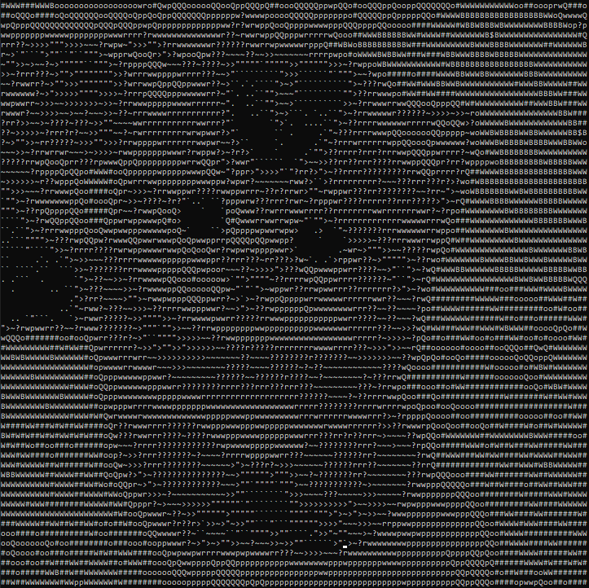

# Picture to ASCII art
This project creates an ASCII art from a given image.

  

## Running this project
Install the required packages in a virtual environment and run the program following the commands:

* `py -m pip install -r requirements.txt`
* `py ascii-art.py -f ../imgs/cat.jpeg -w 120`

Use `py ascii-art.py -h` to view additional options.
