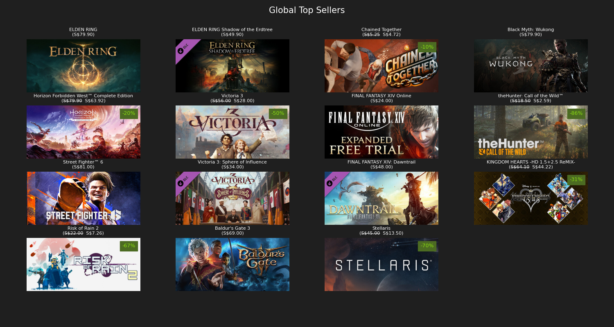

# Steam web scrapper
This project scrapes the Steam website for data on their new releases, top sellers, popular upcoming, and discounted games.

Note: The font utilized in this project is under the Open Font License. You can obtain this font from the following link: https://fonts.google.com/noto/specimen/Noto+Sans+SC.
More information on the copyright and license can be viewed from the OFL.txt file in the font folder.

## Running this project
Install the required packages in a virtual environment and run the program following the commands:

* `py -m pip install -r requirements.txt`
* `py steam-scrapper.py -t 15 -w -i` to show top 15 games for each category, write them to file, and display image summaries.

Use `py steam-scrapper.py -h` to view additional options.